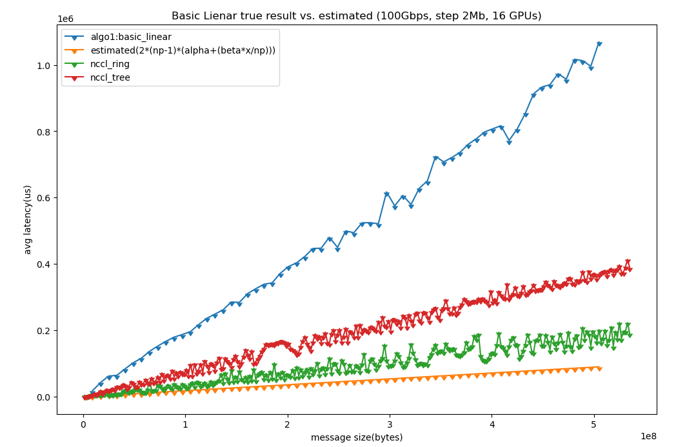

# allreduce-experiments

## Implementations

Experiments scripts can be found [here](./scripts)

### Open MPI

Implementation of different allreduce algorithms

* basic_linear
* nonoverlapping
* recursive_doubling
* ring
* segmented_ring
* rabenseifner

### NCCL Test

* ring
* tree

### Horovod

* [NCCL_ALLREDUCE](./impl/horovod/NCCL_ALLREDUCE.cc)
* [MPI_ALLREDUCE](./impl/horovod/MPI_ALLREDUCE.cc)
* [NCCL_REDUCESCATTER+MPI_ALLREDUCE+NCCL_ALLGATHER](./impl/horovod/NCCL_REDUCESCATTER+MPI_ALLREDUCE+NCCL_ALLGATHER.cc)
* [NCCL_REDUCE+MPI_ALLREDUCE+NCCL_BCAST](./impl/horovod/NCCL_REDUCE+MPI_ALLREDUCE+NCCL_BCAST.cc)
* [NCCL_REDUCESCATTER+NCCL_ALLREDUCE+NCCL_ALLGATHER](./impl/horovod/NCCL_REDUCESCATTER+NCCL_ALLREDUCE+NCCL_ALLGATHERE.cc)
* [NCCL_REDUCE+NCCL_ALLREDUCE+NCCL_BCAST](./impl/horovod/NCCL_REDUCE+NCCL_ALLREDUCE+NCCL_BCAST.cc)

* more on the [blog](https://blog.dex.moe/tutorial/2021/06/08/how-to-write-custom-allreduce-operation.html)

## Experiment Results (Data)

### Open MPI

* [latency](./data/ompi-results/latency)

#### CPU

* Results on server 78012
* [2cpu](./data/ompi-results/2cpu)
* [4cpu](./data/ompi-results/4cpu)
* [8cpu](./data/ompi-results/8cpu)
* [16cpu](./data/ompi-results/16cpu)

* Results on server 9096
    * 10g 
        * [2cpu](./data/ompi-results/new-cluster/10g/2cpu)
        * [4cpu](./data/ompi-results/new-cluster/10g/4cpu)
        * [8cpu](./data/ompi-results/new-cluster/10g/8cpu)
        * [16cpu](./data/ompi-results/new-cluster/10g/16cpu)
    * 100g
        * [2cpu](./data/ompi-results/new-cluster/100g/2cpu)
        * [4cpu](./data/ompi-results/new-cluster/100g/4cpu)
        * [8cpu](./data/ompi-results/new-cluster/100g/8cpu)
        * [16cpu](./data/ompi-results/new-cluster/100g/16cpu)

#### GPU

* [10G Network 16GPU](./data/ompi-results/gpus/10g)
    * step from 1k to 2m
* [100G Network 16GPU](./data/ompi-results/gpus/100g)
    * step from 1k to 2m
* [10G Network 32GPU](./data/ompi-results/ompi-32gpu-results/32gpus/10g)
    * step 2^n
* [100G Network 32GPU](./data/ompi-results/ompi-32gpu-results/32gpus/100g)
    * step 2^n

### NCCL Test

* [10G Network 32GPU](./data/nccl-results/nccl-32gpus/10g)
* [100G Network 32GPU](./data/nccl-results/nccl-32gpus/100g)

### Horovod

* [10G Network 32GPU](./data/horovod-results/32gpu/10g)
* [100G Network 32GPU](./data/horovod-results/32gpu/100g)

## Experiment Results (Graphics)

* **Source code & more plots can be found at notebooks**

### Open MPI

### NCCL

### Horovod

